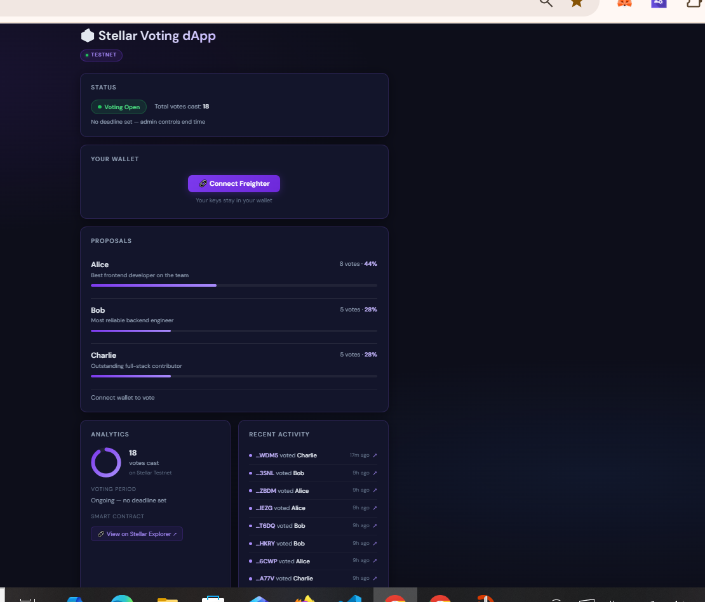

# 🗳️ Stellar Voting dApp

A decentralized, on-chain voting application built on the **Stellar blockchain** using **Soroban smart contracts**. Users connect their Freighter wallet, cast votes for candidates, and all results are recorded immutably on the Stellar Testnet.

## 🚀 Live Demo
Replace with your Vercel URL after deployment

## 🎬 Demo Video
Replace with your recorded demo link

## 📸 Screenshots

## ✨ Features
- Freighter Wallet Integration — connect your Stellar wallet in one click
- On-Chain Voting — votes recorded as Soroban contract calls on Stellar Testnet
- Live Countdown Timer — 48-hour deadline with urgency cues
- Recent Activity Feed — see who voted and when with explorer links
- Vote Receipt Card — transaction hash, wallet address, and explorer links
- Analytics Panel — donut chart, voter turnout, contract info
- Duplicate Vote Protection — contract-level enforcement
- Admin Controls — start/end voting from the UI
- Winner Announcement — displayed automatically when voting ends

## 🛠️ Tech Stack
- Smart Contract: Rust + Soroban SDK
- Frontend: React + Vite
- Blockchain: Stellar Testnet
- Wallet: Freighter Browser Extension
- Deployment: Vercel

## 📋 Contract ID
CAMU6H2XDIX6K52K5FL33A7LHSCEYB3ZRISUAVNLB5FOGWPPE26RFUDY

## ⚙️ Local Setup
1. git clone https://github.com/ShriramMasalge/stellar-voting-dapp.git
2. cd frontend
3. npm install
4. Create frontend/.env with VITE_CONTRACT_ID=CAMU6H2XDIX6K52K5FL33A7LHSCEYB3ZRISUAVNLB5FOGWPPE26RFUDY
5. npm run dev
6. Open http://localhost:5173

## 🧪 Running Tests
cd frontend
npm test
Expected: 6 tests passing

## 📝 Commit History
1. feat: initialize Soroban voting contract with Rust
2. feat: add React frontend with Freighter wallet integration
3. fix: replace SDK simulateTransaction with raw RPC calls
4. feat: add countdown timer vote receipt and activity feed
5. feat: add tests README and complete dark UI redesign

## 👤 Author
Shriram Masalge — Built for the Stellar Mini-dApp Challenge.
